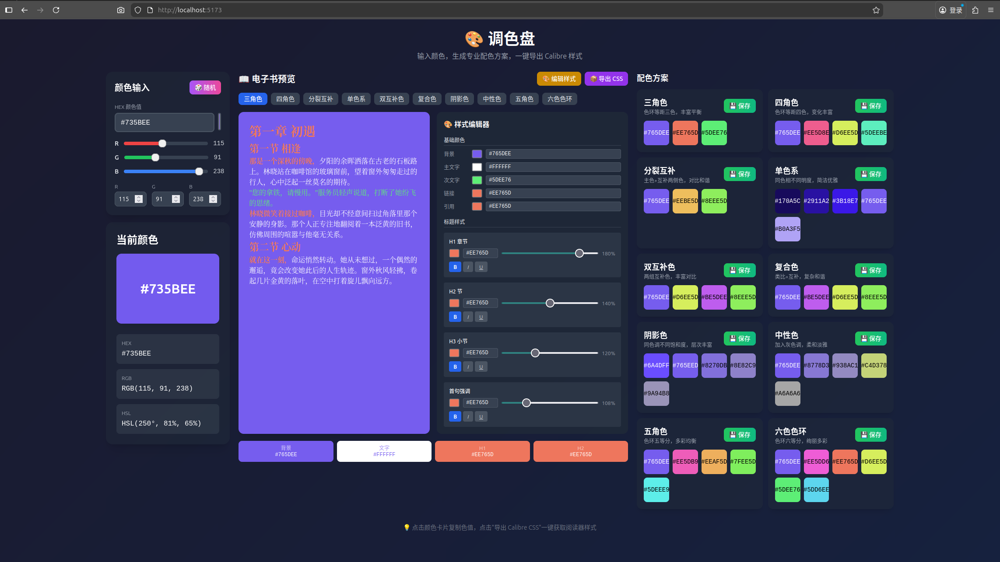

# 🎨 Calibre 调色盘

[English](#english) | [日本語](#日本語) | [中文](#中文)

---

<a name="中文"></a>
## 中文

专为 Calibre 阅读器设计的配色工具，一键生成专业配色方案，支持 17 种预设色系和 10 种配色算法，实时预览电子书效果并导出 CSS 样式。



### ✨ 功能特点

#### 🎨 预设色系

内置 17 种精选色系，一键切换：
- **中国传统色**：中国红、水墨黑、翡翠绿、紫禁城
- **马卡龙色系**：马卡龙粉、马卡龙绿、马卡龙紫
- **莫兰迪色系**：莫兰迪灰、莫兰迪蓝、莫兰迪绿
- **其他风格**：复古米黄、海洋蓝、森林绿、日落橙、夜间模式、羊皮纸

#### 🎯 核心功能

- **实时颜色输入**：支持 RGB 滑块调节、HEX 输入、颜色选择器三种方式
- **随机颜色生成**：一键生成随机颜色，激发灵感
- **10 种专业配色方案**：
  - **三角色**：色环上等距的三个颜色，色彩丰富且平衡
  - **四角色**：色环上等距的四个颜色，提供丰富的色彩变化
  - **分裂互补色**：主色 + 互补色两侧的颜色，既有对比又保持和谐
  - **单色系**：同一色相的不同明度变化，简洁优雅
  - **双互补色**：两组互补色组合，丰富的对比效果
  - **复合色**：类比色 + 互补色的复杂和谐配色
  - **阴影色**：同色调不同饱和度，层次丰富
  - **中性色**：加入灰色调，柔和淡雅
  - **五角色**：色环五等分，多彩均衡
  - **六色色环**：色环六等分，绚丽多彩

#### 📖 电子书预览

- **实时文字预览**：显示示例电子书内容，直观展示配色效果
- **H1/H2/H3 标题样式**：章节标题、节标题、小节标题分别展示
- **段落首句强调**：自动识别首句并高亮显示
- **段落交替颜色**：奇偶段落使用不同颜色，增强阅读体验
- **配色方案切换**：一键切换 10 种配色方案，实时预览效果

#### 🎨 样式编辑器

- **基础颜色调整**：背景色、主文字、次文字、链接、引用边框
- **标题样式编辑** (H1/H2/H3)：颜色选择、字号调节、加粗/斜体/下划线
- **首句强调样式**：颜色、字号、加粗等自定义
- **实时预览**：编辑即时生效

#### 📦 Calibre 一键导出

- **完整 CSS 样式**：包含背景、文字、标题、链接、引用、表格等完整样式
- **一键复制**：支持剪贴板复制和手动选择复制
- **全选功能**：快速选中全部 CSS 代码
- **详细使用教程**：内置 Calibre 设置步骤说明

### 🛠️ 技术栈

- **React 18** - 现代化的 UI 框架
- **TypeScript** - 类型安全的 JavaScript
- **Vite** - 极速的开发构建工具
- **Tailwind CSS** - 实用优先的 CSS 框架
- **TinyColor2** - 强大的颜色处理库

### 🚀 快速开始

```bash
# 安装依赖
npm install

# 启动开发服务器
npm run dev

# 构建生产版本
npm run build
```

访问 http://localhost:5173 查看应用

### 📦 Calibre 使用方法

1. 在本工具中选择喜欢的颜色和配色方案
2. 点击「🎨 编辑样式」自定义各元素颜色和特效
3. 点击「📦 导出 CSS」按钮
4. 点击「📋 一键复制 CSS」或「全选」后手动复制
5. 打开 Calibre 阅读器
6. 进入 **首选项** → **外观** → **样式**
7. 将 CSS 粘贴到样式框中
8. 点击应用，享受新配色！

### 📖 配色方案说明

| 方案 | 颜色数 | 描述 | 适用场景 |
|------|--------|------|----------|
| 三角色 | 3 | 等距三色 | 活泼、丰富的风格 |
| 四角色 | 4 | 等距四色 | 复杂、多变的配色 |
| 分裂互补 | 3 | 主色+互补两侧 | 平衡对比与和谐 |
| 单色系 | 5 | 同色不同明度 | 简洁、专业的设计 |
| 双互补色 | 4 | 两组互补色 | 丰富对比效果 |
| 复合色 | 4 | 类比+互补 | 复杂和谐配色 |
| 阴影色 | 5 | 不同饱和度 | 层次丰富 |
| 中性色 | 5 | 加入灰色调 | 柔和淡雅 |
| 五角色 | 5 | 色环五等分 | 多彩均衡 |
| 六色色环 | 6 | 色环六等分 | 绚丽多彩 |

---

<a name="english"></a>
## English

A color tool designed for Calibre e-reader. Generate professional color schemes with one click, featuring 17 preset palettes and 10 color algorithms. Preview e-book effects in real-time and export CSS styles.


### ✨ Features

#### 🎨 Color Presets

17 curated color presets with one-click switching:
- **Chinese Traditional**: Chinese Red, Ink Black, Jade Green, Forbidden Purple
- **Macaron Series**: Macaron Pink, Macaron Mint, Macaron Lavender
- **Morandi Series**: Morandi Gray, Morandi Blue, Morandi Green
- **Other Styles**: Retro Cream, Ocean Blue, Forest Green, Sunset Orange, Night Mode, Sepia

#### 🎯 Core Features

- **Real-time Color Input**: RGB sliders, HEX input, and color picker
- **Random Color Generation**: One-click random color for inspiration
- **10 Professional Color Schemes**:
  - **Triadic**: Three equidistant colors on the color wheel, rich and balanced
  - **Square**: Four equidistant colors, providing rich color variations
  - **Split-Complementary**: Base color + two colors adjacent to its complement
  - **Monochromatic**: Different lightness of the same hue, simple and elegant
  - **Double-Complementary**: Two pairs of complementary colors for rich contrast
  - **Compound**: Analogous + complementary colors for complex harmony
  - **Shades**: Same hue with different saturation, layered richness
  - **Neutral**: Added gray tones for soft, subtle colors
  - **Five-Tone**: Five equidistant colors for colorful balance
  - **Six-Tone**: Six equidistant colors for vibrant variety

#### 📖 E-book Preview

- **Real-time Text Preview**: Sample e-book content with live color effects
- **H1/H2/H3 Title Styles**: Chapter, section, and subsection titles displayed separately
- **First Sentence Emphasis**: Auto-highlight first sentences
- **Alternating Paragraph Colors**: Odd/even paragraphs with different colors
- **Scheme Switching**: One-click switching between 10 schemes with live preview

#### 🎨 Style Editor

- **Basic Color Adjustment**: Background, primary text, secondary text, links, blockquote border
- **Title Style Editing** (H1/H2/H3): Color, font size (80%-200%), bold/italic/underline
- **First Sentence Emphasis Style**: Customizable color, size, and bold
- **Real-time Preview**: Changes take effect immediately

#### 📦 Calibre One-Click Export

- **Complete CSS Styles**: Background, text, titles, links, quotes, tables, etc.
- **One-Click Copy**: Clipboard copy and manual selection support
- **Select All**: Quickly select all CSS code
- **Detailed Tutorial**: Built-in Calibre setup instructions

### 🛠️ Tech Stack

- **React 18** - Modern UI framework
- **TypeScript** - Type-safe JavaScript
- **Vite** - Fast build tool
- **Tailwind CSS** - Utility-first CSS framework
- **TinyColor2** - Powerful color manipulation library

### 🚀 Quick Start

```bash
# Install dependencies
npm install

# Start dev server
npm run dev

# Build for production
npm run build
```

Visit http://localhost:5173

### 📦 Calibre Usage

1. Select your favorite color and scheme
2. Click "🎨 Edit Style" to customize colors and effects
3. Click "📦 Export CSS" button
4. Click "📋 Copy CSS" or "Select All" for manual copy
5. Open Calibre e-reader
6. Go to **Preferences** → **Look & Feel** → **Styles**
7. Paste CSS into the style box
8. Apply and enjoy your new colors!

### 📖 Color Scheme Guide

| Scheme | Colors | Description | Best For |
|--------|--------|-------------|----------|
| Triadic | 3 | Three equidistant colors | Lively, rich styles |
| Square | 4 | Four equidistant colors | Complex, varied schemes |
| Split-Complementary | 3 | Base + adjacent to complement | Balanced contrast |
| Monochromatic | 5 | Same hue, different lightness | Simple, professional design |
| Double-Complementary | 4 | Two complementary pairs | Rich contrast effects |
| Compound | 4 | Analogous + complementary | Complex harmonious schemes |
| Shades | 5 | Different saturation levels | Rich layering |
| Neutral | 5 | Added gray tones | Soft, subtle appearance |
| Five-Tone | 5 | Five equidistant colors | Colorful balance |
| Six-Tone | 6 | Six equidistant colors | Vibrant variety |

---

<a name="日本語"></a>
## 日本語

Calibre電子書籍リーダー専用の配色ツール。17種類のプリセットと10種類の配色アルゴリズムでプロフェッショナルな配色をワンクリックで生成。電子書籍の効果をリアルタイムでプレビューし、CSSスタイルをエクスポート。


### ✨ 機能

#### 🎯 コア機能

- **リアルタイム色入力**：RGBスライダー、HEX入力、カラーピッカーの3方式に対応
- **ランダム色生成**：ワンクリックでランダムな色を生成、インスピレーションを刺激
- **10種類のプロフェッショナル配色スキーム**：
  - **トライアド**：色相環上で等間隔の3色、豊かでバランスの取れた配色
  - **スクエア**：色相環上で等間隔の4色、豊かな色彩変化を提供
  - **スプリットコンプリメンタリー**：ベース色＋補色の両隣の色
  - **モノクロマティック**：同じ色相で異なる明度、シンプルでエレガント
  - **ダブルコンプリメンタリー**：2組の補色、豊かなコントラスト効果
  - **コンパウンド**：類似色＋補色の複雑で調和の取れた配色
  - **シェード**：同じ色調で異なる彩度、豊かな階調
  - **ニュートラル**：グレートーンを追加、柔らかく淡い色
  - **ファイブトーン**：色相環を5等分、カラフルでバランスの取れた配色
  - **シックストーン**：色相環を6等分、鮮やかで多彩な配色

#### 📖 電子書籍プレビュー

- **リアルタイムテキストプレビュー**：サンプル電子書籍コンテンツで配色効果を直感的に表示
- **H1/H2/H3タイトルスタイル**：章タイトル、節タイトル、小節タイトルを個別に表示
- **最初の文の強調**：最初の文を自動認識してハイライト表示
- **段落の交互色**：奇数・偶数段落で異なる色を使用、読書体験を向上
- **スキーム切り替え**：10種類の配色スキームをワンクリックで切り替え、リアルタイムプレビュー

#### 🎨 スタイルエディタ

- **基本色の調整**：背景色、メインテキスト、サブテキスト、リンク、引用枠線
- **タイトルスタイル編集**（H1/H2/H3）：色選択、フォントサイズ調整、太字/斜体/下線
- **最初の文の強調スタイル**：色、サイズ、太字などをカスタマイズ
- **リアルタイムプレビュー**：編集が即座に反映

#### 📦 Calibreワンクリックエクスポート

- **完全なCSSスタイル**：背景、テキスト、タイトル、リンク、引用、テーブルなどを含む完全なスタイル
- **ワンクリックコピー**：クリップボードコピーと手動選択コピーに対応
- **全選択**：CSSコードを素早く全選択
- **詳細なチュートリアル**：Calibre設定手順を内蔵

### 🛠️ 技術スタック

- **React 18** - モダンなUIフレームワーク
- **TypeScript** - 型安全なJavaScript
- **Vite** - 高速ビルドツール
- **Tailwind CSS** - ユーティリティファーストCSSフレームワーク
- **TinyColor2** - 強力な色操作ライブラリ

### 🚀 クイックスタート

```bash
# 依存関係をインストール
npm install

# 開発サーバーを起動
npm run dev

# 本番用にビルド
npm run build
```

http://localhost:5173 にアクセス

### 📦 Calibreの使い方

1. お気に入りの色とスキームを選択
2. 「🎨 スタイル編集」で色とエフェクトをカスタマイズ
3. 「📦 CSSエクスポート」ボタンをクリック
4. 「📋 CSSをコピー」または「全選択」で手動コピー
5. Calibre電子書籍リーダーを開く
6. **環境設定** → **外観** → **スタイル** に移動
7. CSSをスタイルボックスに貼り付け
8. 適用して新しい配色をお楽しみください！

### 📖 配色スキームガイド

| スキーム | 色数 | 説明 | 適用シーン |
|----------|------|------|------------|
| トライアド | 3 | 等間隔の3色 | 活発で豊かなスタイル |
| スクエア | 4 | 等間隔の4色 | 複雑で変化に富んだ配色 |
| スプリットコンプリメンタリー | 3 | ベース色＋補色の両隣 | バランスの取れたコントラスト |
| モノクロマティック | 5 | 同じ色相で異なる明度 | シンプルでプロフェッショナルなデザイン |
| ダブルコンプリメンタリー | 4 | 2組の補色 | 豊かなコントラスト効果 |
| コンパウンド | 4 | 類似色＋補色 | 複雑で調和の取れた配色 |
| シェード | 5 | 異なる彩度レベル | 豊かな階調 |
| ニュートラル | 5 | グレートーンを追加 | 柔らかく淡い外観 |
| ファイブトーン | 5 | 5つの等間隔色 | カラフルなバランス |
| シックストーン | 6 | 6つの等間隔色 | 鮮やかな多様性 |

---

## 📄 License

MIT

---

Made with ❤️ | [GitHub](https://github.com/HumSunTT/Color-Palette)